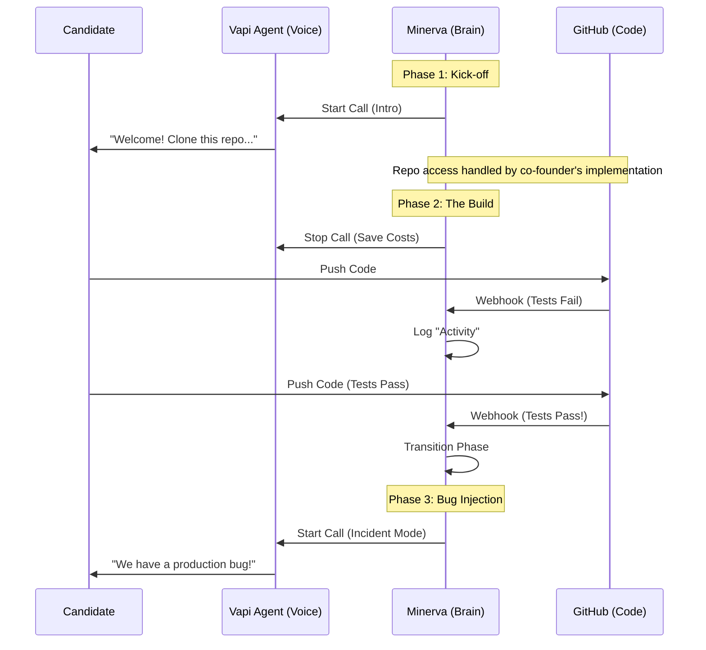

# Minerva 

**Autonomous Voice-Driven Technical Interviewer**

Minerva is an agentic system that conducts end-to-end coding interviews using voice (Vapi.ai) and real coding environments (GitHub). It measures candidate "slope" (velocity & learning rate) by tracking their progress through a multi-phase technical challenge.

## Architecture

Minerva acts as the orchestrator between the Candidate, the Voice Agent, and the Codebase.



## Key Features

- **Voice-First Experience:** Uses Vapi.ai for low-latency, natural conversation.
- **Cost Optimized:** The voice agent **sleeps** during deep work phases (Build/Fix), reducing costs by ~65% ($0.80/interview vs $2.40).
- **Real Engineering Signal:**
    - **Quality Gates:** Phases only advance when tests PASS (`check_suite` success).
    - **Velocity Tracking:** Measures time-to-solution, not just completion.
- **Automated Infrastructure:**
    - Integrates with existing repo access management.
    - Tracks commits and test results via webhooks.

## Setup & Installation

### Prerequisites
- Node.js 18+ (or 22+ for Hermes features)
- Vapi.ai Account
- Supabase Project
- Repo access management (handled by co-founder's implementation)

### Environment Variables

Create a `.env.local` file in the root directory with the following variables:

```env
# Vapi Configuration (for Minerva)
NEXT_PUBLIC_VAPI_PUBLIC_KEY=
VAPI_ASSISTANT_ID=          # Single assistant ID for all phases (kickoff, bug_injection, post_mortem)
MINERVA_WEBHOOK_URL=     # Public URL (e.g. https://minerva.app or ngrok) - for GitHub webhooks

# Supabase (shared)
NEXT_PUBLIC_SUPABASE_URL=your_supabase_url
NEXT_PUBLIC_SUPABASE_ANON_KEY=your_supabase_anon_key
SUPABASE_SERVICE_ROLE_KEY=your_service_role_key

# Resend (for Hermes waitlist emails)
RESEND_API_KEY=your_resend_api_key
RESEND_FROM_EMAIL=your_verified_email@yourdomain.com  # Optional, defaults to noreply@joinhermes.co

# App URL (for email links)
NEXT_PUBLIC_APP_URL=https://yourdomain.com  # Optional, defaults to https://coldstart.ai

# Waitlist Email Content (optional - can customize in script)
WAITLIST_EMAIL_SUBJECT=Your Launch Subject
WAITLIST_EMAIL_HTML=<your HTML email template>
WAITLIST_EMAIL_TEXT=<your plain text email template>
```

### Installation

```bash
npm install
npm run dev
```

## Development Flow

Since Minerva relies on GitHub Webhooks, you must expose your local server to the internet.

1.  **Start Local Server:**
    ```bash
    npm run dev
    ```

2.  **Start Ngrok Tunnel:**
    ```bash
    ngrok http 3000
    ```

3.  **Update Config:**
    Set `MINERVA_WEBHOOK_URL` in `.env.local` to your ngrok URL (e.g., `https://a1b2.ngrok-free.app`).

## Testing

We have dedicated simulation scripts to test the backend without a real candidate:

- **Full Interview Simulation:**
    ```bash
    node --env-file=.env.local tests/test-interview-flow.js
    ```
- **Webhook Security Test:**
    ```bash
    node --env-file=.env.local tests/test-webhook-setup.js
    ```

## Project Structure

This repository contains both:
- **Minerva**: The autonomous voice-driven technical interviewer system
- **Hermes**: The candidate matching and resume platform

The project uses Next.js with both App Router (`app/`) and Pages Router (`pages/`) for different features.

## Learn More

- [Next.js Documentation](https://nextjs.org/docs) - learn about Next.js features and API.
- [Learn Next.js](https://nextjs.org/learn) - an interactive Next.js tutorial.

## Deploy on Vercel

The easiest way to deploy your Next.js app is to use the [Vercel Platform](https://vercel.com/new?utm_medium=default-template&filter=next.js&utm_source=create-next-app&utm_campaign=create-next-app-readme) from the creators of Next.js.

Check out our [Next.js deployment documentation](https://nextjs.org/docs/app/building-your-application/deploying) for more details.
