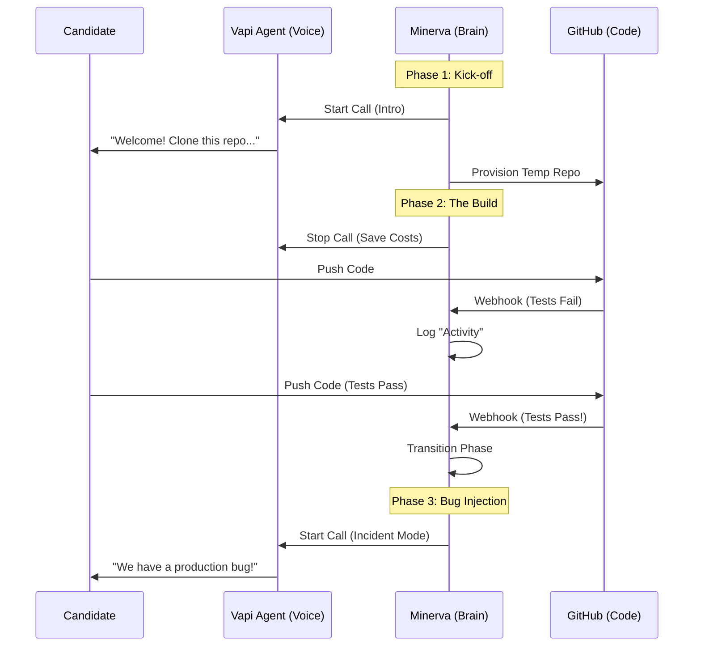

# Minerva 

**Autonomous Voice-Driven Technical Interviewer**

Minerva is an agentic system that conducts end-to-end coding interviews using voice (Vapi.ai) and real coding environments (GitHub). It measures candidate "slope" (velocity & learning rate) by tracking their progress through a multi-phase technical challenge.

## Architecture

Minerva acts as the orchestrator between the Candidate, the Voice Agent, and the Codebase.



## Key Features

- **Voice-First Experience:** Uses Vapi.ai for low-latency, natural conversation.
- **Cost Optimized:** The voice agent **sleeps** during deep work phases (Build/Fix), reducing costs by ~65% ($0.80/interview vs $2.40).
- **Real Engineering Signal:**
    - **Quality Gates:** Phases only advance when tests PASS (`check_suite` success).
    - **Velocity Tracking:** Measures time-to-solution, not just completion.
- **Automated Infrastructure:**
    - Provisions private GitHub repos per candidate.
    - Auto-configures webhooks.
    - Arhives repos upon completion.

## Setup & Installation

### Prerequisites
- Node.js 18+
- GitHub Account with PAT (Personal Access Token)
- Vapi.ai Account
- Supabase Project

### Environment Variables
Copy `.env.local.example` to `.env.local` and fill in:

```bash
# Vapi Configuration
NEXT_PUBLIC_VAPI_PUBLIC_KEY=
VAPI_PRIVATE_KEY=
VAPI_KICKOFF_ASSISTANT_ID=
VAPI_BUG_INJECTION_ASSISTANT_ID=
VAPI_POST_MORTEM_ASSISTANT_ID=

# GitHub Configuration for Repo Manager
GITHUB_ACCESS_TOKEN=     # PAT with 'repo' and 'admin:org' scopes
GITHUB_ORG_NAME=         # Org where temp repos live
GITHUB_SEED_REPO=        # Template repo name
GITHUB_WEBHOOK_SECRET=   # Secret for webhook verification

# App Configuration
MINERVA_WEBHOOK_URL=     # Public URL (e.g. https://minerva.app or ngrok)
NEXT_PUBLIC_SUPABASE_URL=
NEXT_PUBLIC_SUPABASE_ANON_KEY=
SUPABASE_SERVICE_ROLE_KEY=
```

### Installation

```bash
npm install
npm run dev
```

## Development Flow

Since Minerva relies on GitHub Webhooks, you must expose your local server to the internet.

1.  **Start Local Server:**
    ```bash
    npm run dev
    ```

2.  **Start Ngrok Tunnel:**
    ```bash
    ngrok http 3000
    ```

3.  **Update Config:**
    Set `MINERVA_WEBHOOK_URL` in `.env.local` to your ngrok URL (e.g., `https://a1b2.ngrok-free.app`).

## Testing

We have dedicated simulation scripts to test the backend without a real candidate:

- **Full Interview Simulation:**
    ```bash
    node --env-file=.env.local tests/test-interview-flow.js
    ```
- **Webhook Security Test:**
    ```bash
    node --env-file=.env.local tests/test-webhook-setup.js
    ```
