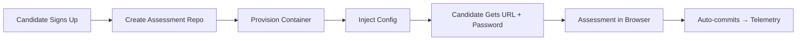

# Docker Assessment Environment - Integration & Deployment Guide

This document outlines the next steps to integrate the containerized IDE environment into your Minerva assessment workflow.

---

## 📋 Integration Overview



---

## 🚀 Step 1: Image Hosting

You need to push the Docker image to a container registry. Choose one:

### Option A: GitHub Container Registry (Recommended - Free)

```bash
# 1. Login to GitHub Container Registry
echo $GITHUB_TOKEN | docker login ghcr.io -u USERNAME --password-stdin

# 2. Tag the image
docker tag hermes-assessment:latest ghcr.io/hermes-startup/hermes-assessment:latest
docker tag hermes-assessment:latest ghcr.io/hermes-startup/hermes-assessment:v1.0.0

# 3. Push to registry
docker push ghcr.io/hermes-startup/hermes-assessment:latest
docker push ghcr.io/hermes-startup/hermes-assessment:v1.0.0

# 4. Make the package public (in GitHub repo settings)
# Navigate to: Packages → hermes-assessment → Package settings → Change visibility
```

### Option B: Docker Hub

```bash
# 1. Login
docker login

# 2. Tag and push
docker tag hermes-assessment:latest hermesstartup/hermes-assessment:latest
docker push hermesstartup/hermes-assessment:latest
```

### Option C: AWS ECR (If using AWS infrastructure)

```bash
# 1. Create ECR repository
aws ecr create-repository --repository-name hermes-assessment

# 2. Login
aws ecr get-login-password --region us-west-2 | \
    docker login --username AWS --password-stdin <account-id>.dkr.ecr.us-west-2.amazonaws.com

# 3. Tag and push
docker tag hermes-assessment:latest <account-id>.dkr.ecr.us-west-2.amazonaws.com/hermes-assessment:latest
docker push <account-id>.dkr.ecr.us-west-2.amazonaws.com/hermes-assessment:latest
```

---

## 🏗️ Step 2: Container Hosting Infrastructure

Choose a platform to host and manage candidate containers:

### Option A: AWS ECS Fargate (Recommended for Scale)

**Pros:**
- Serverless (no server management)
- Pay per second of container runtime
- Auto-scaling
- Tight AWS integration

**Setup:**
```bash
# Create ECS cluster
aws ecs create-cluster --cluster-name hermes-assessment-cluster

# Create task definition (see ecs-task-definition.json below)
aws ecs register-task-definition --cli-input-json file://ecs-task-definition.json
```

### Option B: Google Cloud Run (Easiest)

**Pros:**
- Truly serverless
- Automatic HTTPS
- 2M requests/month free tier
- Simple deployment

**Setup:**
```bash
# Deploy to Cloud Run
gcloud run deploy hermes-assessment \
    --image ghcr.io/hermes-startup/hermes-assessment:latest \
    --platform managed \
    --region us-central1 \
    --allow-unauthenticated \
    --set-env-vars "TELEMETRY_URL=https://yourapp.com"
```

### Option C: DigitalOcean App Platform (Simplest)

**Pros:**
- Simple UI
- $12/month per container
- Managed infrastructure

**Setup:** Use DigitalOcean dashboard to deploy from GitHub Container Registry

---

## 🔌 Step 3: API Integration

Create a new endpoint to provision containers for candidates:

### New Endpoint: `POST /api/topcandidates/provision-container`

```typescript
// app/api/topcandidates/provision-container/route.ts
import { NextRequest, NextResponse } from 'next/server';
import { createServerClient } from '@supabase/ssr';
import { cookies } from 'next/headers';

/**
 * POST /api/topcandidates/provision-container
 * 
 * Provisions a containerized IDE environment for a candidate
 * Returns URL and access credentials
 */
export async function POST(request: NextRequest) {
  try {
    const { sessionId } = await request.json();
    
    const cookieStore = await cookies();
    const supabase = createServerClient(
      process.env.NEXT_PUBLIC_SUPABASE_URL!,
      process.env.NEXT_PUBLIC_SUPABASE_ANON_KEY!,
      {
        cookies: {
          getAll() { return cookieStore.getAll(); },
          setAll() {},
        },
      }
    );

    const { data: { user }, error: authError } = await supabase.auth.getUser();
    if (authError || !user) {
      return NextResponse.json({ error: 'Unauthorized' }, { status: 401 });
    }

    // Get candidate
    const { data: candidate } = await supabase
      .from('candidates')
      .select('id, email')
      .eq('email', user.email)
      .single();

    if (!candidate) {
      return NextResponse.json({ error: 'Candidate not found' }, { status: 404 });
    }

    // Generate secure password for code-server
    const password = generateSecurePassword();
    
    // Choose your container orchestration method:
    // - AWS ECS: See provisionECSContainer()
    // - Google Cloud Run: See provisionCloudRunContainer()
    // - DigitalOcean: See provisionDOContainer()
    
    const containerUrl = await provisionContainer({
      candidateId: candidate.id,
      sessionId: sessionId,
      password: password,
      telemetryUrl: process.env.NEXT_PUBLIC_APP_URL!,
    });

    // Store container info in database
    await supabase
      .from('interview_sessions')
      .update({
        container_url: containerUrl,
        container_password: password, // Encrypt this!
      })
      .eq('session_id', sessionId);

    return NextResponse.json({
      url: containerUrl,
      password: password,
      expiresIn: '2 hours',
    });

  } catch (error) {
    console.error('[Provision Container] Error:', error);
    return NextResponse.json(
      { error: 'Failed to provision container' },
      { status: 500 }
    );
  }
}

function generateSecurePassword(): string {
  return crypto.randomUUID().slice(0, 16);
}

async function provisionContainer(config: {
  candidateId: string;
  sessionId: string;
  password: string;
  telemetryUrl: string;
}): Promise<string> {
  // TODO: Implement based on your chosen platform
  // See platform-specific implementations below
  throw new Error('Not implemented');
}
```

---

## 🐳 Step 4: Platform-Specific Container Provisioning

### AWS ECS Implementation

```typescript
// lib/container-orchestration/aws-ecs.ts
import { ECSClient, RunTaskCommand } from "@aws-sdk/client-ecs";

export async function provisionECSContainer(config: {
  candidateId: string;
  sessionId: string;
  password: string;
  telemetryUrl: string;
}): Promise<string> {
  const client = new ECSClient({ region: 'us-west-2' });
  
  const command = new RunTaskCommand({
    cluster: 'hermes-assessment-cluster',
    taskDefinition: 'hermes-assessment-task',
    launchType: 'FARGATE',
    networkConfiguration: {
      awsvpcConfiguration: {
        subnets: [process.env.AWS_SUBNET_ID!],
        securityGroups: [process.env.AWS_SECURITY_GROUP_ID!],
        assignPublicIp: 'ENABLED',
      },
    },
    overrides: {
      containerOverrides: [{
        name: 'hermes-assessment',
        environment: [
          { name: 'CANDIDATE_ID', value: config.candidateId },
          { name: 'SESSION_ID', value: config.sessionId },
          { name: 'PASSWORD', value: config.password },
          { name: 'TELEMETRY_URL', value: config.telemetryUrl },
          { name: 'AUTO_COMMIT_INTERVAL', value: '120' },
        ],
      }],
    },
  });

  const response = await client.send(command);
  const taskArn = response.tasks?.[0]?.taskArn;
  
  if (!taskArn) {
    throw new Error('Failed to start ECS task');
  }

  // Wait for task to get public IP (you'll need to implement this)
  const publicIp = await waitForTaskPublicIP(taskArn);
  
  return `http://${publicIp}:8080`;
}
```

### Google Cloud Run Implementation

```typescript
// lib/container-orchestration/google-cloud-run.ts
import { google } from 'googleapis';

export async function provisionCloudRunContainer(config: {
  candidateId: string;
  sessionId: string;
  password: string;
  telemetryUrl: string;
}): Promise<string> {
  const run = google.run('v1');
  
  // Create a new Cloud Run service for this candidate
  const serviceName = `assessment-${config.candidateId.slice(0, 8)}`;
  
  await run.namespaces.services.create({
    parent: `namespaces/${process.env.GCP_PROJECT_ID}`,
    requestBody: {
      apiVersion: 'serving.knative.dev/v1',
      kind: 'Service',
      metadata: {
        name: serviceName,
        annotations: {
          'run.googleapis.com/ingress': 'all',
        },
      },
      spec: {
        template: {
          spec: {
            containers: [{
              image: 'ghcr.io/hermes-startup/hermes-assessment:latest',
              env: [
                { name: 'CANDIDATE_ID', value: config.candidateId },
                { name: 'SESSION_ID', value: config.sessionId },
                { name: 'PASSWORD', value: config.password },
                { name: 'TELEMETRY_URL', value: config.telemetryUrl },
              ],
              ports: [{ containerPort: 8080 }],
            }],
          },
        },
      },
    },
  });

  return `https://${serviceName}-<hash>-uc.a.run.app`;
}
```

---

## 🔧 Step 5: Update Candidate Workflow

Modify your existing assessment flow to include container provisioning:

### Update `/api/interview/start` Endpoint

```typescript
// app/api/interview/start/route.ts

// Add after creating interview session:

// 1. Provision container for candidate
const containerResponse = await fetch(`${origin}/api/topcandidates/provision-container`, {
  method: 'POST',
  headers: {
    'Content-Type': 'application/json',
    'Cookie': request.headers.get('Cookie') || '',
  },
  body: JSON.stringify({
    sessionId: sessionId,
  }),
});

if (!containerResponse.ok) {
  console.error('Failed to provision container');
  // Fallback to GitHub repo workflow
}

const { url: containerUrl, password: containerPassword } = await containerResponse.json();

// 2. Return container credentials to candidate
return NextResponse.json({
  sessionId,
  containerUrl,
  containerPassword,
  message: 'Your assessment environment is ready!',
});
```

### Update OnboardingModal.tsx

```tsx
// components/modals/OnboardingModal.tsx

const startAssessment = async () => {
  const response = await fetch('/api/interview/start', {
    method: 'POST',
  });
  
  const { sessionId, containerUrl, containerPassword } = await response.json();
  
  // Show credentials to candidate
  setAssessmentReady(true);
  setContainerCredentials({ url: containerUrl, password: containerPassword });
};

// Render:
{assessmentReady && (
  <div className="container-credentials">
    <h3>Your Assessment Environment is Ready!</h3>
    <p>Click the link below to access your IDE:</p>
    <a href={containerCredentials.url} target="_blank">
      {containerCredentials.url}
    </a>
    <p>Password: <code>{containerCredentials.password}</code></p>
    <button onClick={() => {
      navigator.clipboard.writeText(containerCredentials.password);
    }}>
      Copy Password
    </button>
  </div>
)}
```

---

## 🔐 Step 6: Claude Code Proxy Integration

The `.claude/settings.local.json` is already configured to use the telemetry proxy. Ensure your other agent creates:

### Required Endpoint: `POST /api/proxy/claude`

```typescript
// app/api/proxy/claude/route.ts
import { NextRequest, NextResponse } from 'next/server';

export async function POST(request: NextRequest) {
  try {
    const body = await request.json();
    
    // 1. Log the prompt for telemetry
    await logClaudePrompt({
      sessionId: body.sessionId || extractSessionFromHeaders(request),
      prompt: body.prompt,
      model: body.model,
    });

    // 2. Forward to actual Claude API
    const claudeResponse = await fetch('https://api.anthropic.com/v1/messages', {
      method: 'POST',
      headers: {
        'Content-Type': 'application/json',
        'x-api-key': process.env.ANTHROPIC_API_KEY!,
        'anthropic-version': '2023-06-01',
      },
      body: JSON.stringify(body),
    });

    const responseData = await claudeResponse.json();

    // 3. Log the response
    await logClaudeResponse({
      sessionId: body.sessionId,
      response: responseData,
      tokensUsed: responseData.usage?.total_tokens,
    });

    // 4. Return to container
    return NextResponse.json(responseData);

  } catch (error) {
    console.error('[Claude Proxy] Error:', error);
    return NextResponse.json({ error: 'Proxy error' }, { status: 500 });
  }
}
```

---

## 📊 Step 7: Database Schema Updates

Add container tracking fields to `interview_sessions`:

```sql
-- supabase/migrations/046_add_container_tracking.sql

ALTER TABLE public.interview_sessions
ADD COLUMN container_url TEXT,
ADD COLUMN container_password TEXT, -- Encrypt this!
ADD COLUMN container_status TEXT DEFAULT 'provisioning',
ADD COLUMN container_started_at TIMESTAMP WITH TIME ZONE,
ADD COLUMN container_stopped_at TIMESTAMP WITH TIME ZONE;

CREATE INDEX idx_interview_sessions_container_status 
ON public.interview_sessions(container_status);
```

---

## 🧹 Step 8: Container Cleanup

Implement automatic container cleanup after assessment completion:

```typescript
// lib/container-orchestration/cleanup.ts

export async function cleanupContainer(sessionId: string) {
  // 1. Get container info from database
  const { data: session } = await supabase
    .from('interview_sessions')
    .select('container_url, container_status')
    .eq('session_id', sessionId)
    .single();

  if (!session?.container_url) return;

  // 2. Stop/delete the container
  await stopContainer(session.container_url);

  // 3. Update database
  await supabase
    .from('interview_sessions')
    .update({
      container_status: 'stopped',
      container_stopped_at: new Date().toISOString(),
    })
    .eq('session_id', sessionId);
}

// Schedule cleanup via cron or call from /api/interview/complete endpoint
```

---

## 📝 Summary Checklist

- [ ] **Push Docker image to GitHub Container Registry**
- [ ] **Choose and set up container hosting** (AWS ECS / Cloud Run / DigitalOcean)
- [ ] **Create `/api/topcandidates/provision-container` endpoint**
- [ ] **Update `/api/interview/start` to provision containers**
- [ ] **Ensure Claude proxy endpoint `/api/proxy/claude` exists** (other agent)
- [ ] **Update database schema** for container tracking
- [ ] **Update OnboardingModal** to display container credentials
- [ ] **Implement container cleanup** after assessment
- [ ] **Test end-to-end flow** with a real candidate

---

## 🚨 Important Security Notes

1. **Encrypt container passwords** before storing in database
2. **Set container timeouts** to auto-stop after 2-3 hours
3. **Implement rate limiting** on container provisioning
4. **Monitor container costs** - each candidate = running container
5. **Use environment-specific** telemetry URLs (staging vs production)

---

## 💰 Cost Estimates

| Platform | Cost per Assessment | Notes |
|----------|---------------------|-------|
| AWS ECS Fargate | $0.08-0.15 | ~2 hours @ 1 vCPU, 2GB RAM |
| Google Cloud Run | $0.05-0.10 | Pay per second, auto-scales to zero |
| DigitalOcean | $12/month | Fixed cost, multiple assessments |

**Recommendation**: Start with Google Cloud Run for lowest cost and easiest setup.
